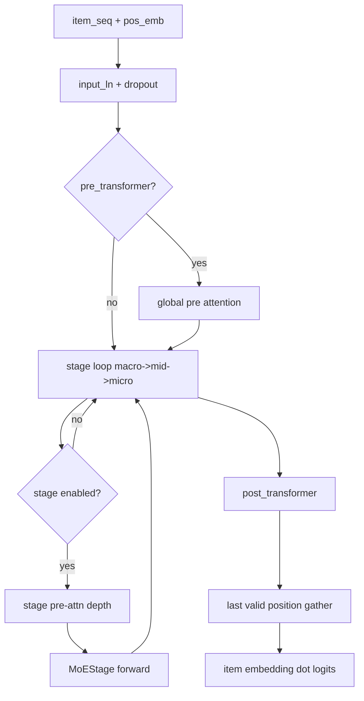
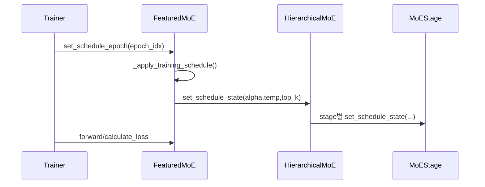

# FeaturedMoE Deep Dive

## 1) 구현 프레임워크
- Entry class: `FeaturedMoE` (`featured_moe.py`)
- Stage engine: `HierarchicalMoE` / `MoEStage` (`moe_stages.py`)
- Routing core: `Router`, `load_balance_loss` (`routers.py`)
- Expert core: `ExpertGroup` (`experts.py`)
- Attention backbone: `TransformerEncoder` (`transformer.py`)

## 2) 초기화(생성) 순서
1. `arch_layout_catalog` 파싱 및 `arch_layout_id` 선택
2. 선택 layout으로 `n_pre_layer`, `n_pre_macro`, `n_pre_mid`, `n_pre_micro`, `n_post_layer` 확정
3. `num_layers` budget 검증(고정 budget 모드)
4. MoE 공통 설정(top-k policy, temperature, reliability gating 등) 로드
5. 레이어 생성
- `pre_transformer`
- stage pre 블록(`stage_pre_transformers` 또는 `stage_pre_repeat_blocks`)
- `hierarchical_moe` (stage on/off는 depth>=0 기준)
- `post_transformer`
6. 스케줄 초기화: `set_schedule_epoch(epoch_idx=0, ...)`

## 3) Forward 데이터 흐름

`MoEStage.forward` 내부:
1. `hidden` pre-LN
2. stage feature 추출/투영 + (옵션) reliability gating
3. router 입력 구성(hidden/feature toggle)
4. `Router.forward`로 gate weights/logits 생성
5. `ExpertGroup` 출력 계산
6. weighted sum + residual(`alpha * alpha_scale`)

## 4) 학습/손실
- 메인 손실: `cross_entropy(logits, pos_items)`
- 보조 손실:
  - stage gate load-balance: `HierarchicalMoE.compute_aux_loss`
  - optional FFN-MoE load-balance
- 최종: `total_loss = ce_loss + aux_loss`

## 5) 스케줄 동작
- 핵심 메서드: `_resolve_top_k_target`, `_scheduled_top_k`, `_apply_training_schedule`
- epoch마다 `set_schedule_epoch(...)` 호출 시 아래 반영:
  - `alpha_scale` warmup
  - mid/micro router temperature warmup
  - top-k warmup(`moe_top_k_start` -> target)

## 6) 파라미터 영향 포인트
- 구조: `arch_layout_id`, `stage_moe_repeat_after_pre_layer`
- 라우팅 sparsity: `moe_top_k*`, `moe_top_k_policy`, `moe_top_k_ratio`
- 라우팅 안정성: `mid/micro_router_temperature*`, `*_feature_dropout`
- 용량/메모리: `expert_scale`, `d_expert_hidden`, `d_router_hidden`, `hidden_size`
- collapse 방지: `balance_loss_lambda`

## 7) 자주 나오는 실패 패턴
- OOM: `expert_scale`, `d_expert_hidden`, batch size, sequence length 조합 과대
- expert collapse: `balance_loss_lambda` 너무 낮거나 temperature 너무 낮음
- 과한 routing noise: `*_feature_dropout` 과다, `use_valid_ratio_gating` 데이터 불안정
- layout mismatch 경고: depth alias와 `arch_layout_id` 불일치(실행은 layout 우선)

## 8) 디버깅 체크리스트
1. 로그의 selected layout/override 경고 확인
2. stage별 gate 분포(특정 expert 쏠림 여부) 확인
3. timeline(`run/artifacts/timeline`)에서 run status/OOM 분리 확인
4. 결과 JSON의 `best_params`, `fixed_search`, `run_axis/run_phase` 일치 확인
