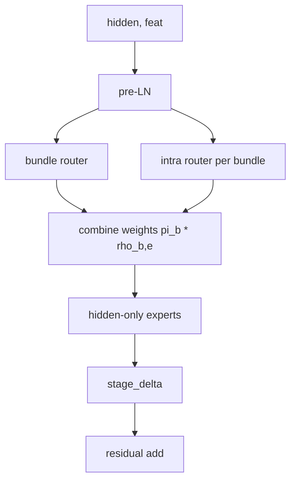
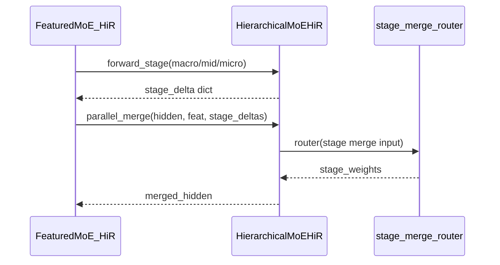

# FeaturedMoE_HiR Deep Dive

## 1) 구현 프레임워크
- Entry class: `FeaturedMoE_HiR` (`featured_moe_hir.py`)
- Stage engine: `HierarchicalMoEHiR` / `HierarchicalStageMoE` (`hir_moe_stages.py`)
- Routing core: `Router` (`FeaturedMoE/routers.py`)
- Attention backbone: `TransformerEncoder` (`FeaturedMoE/transformer.py`)

## 2) 초기화(생성) 순서
1. layout 파싱/검증(`arch_layout_catalog`, `arch_layout_id`)
2. 공통 routing/schedule 설정 로드
3. HiR 전용 설정 로드
- `bundle_top_k`
- `stage_merge_mode`
- `parallel_stage_gate_top_k`
- `hir_use_bundle_aux_loss`, `hir_bundle_aux_lambda_scale`
4. 레이어 생성
- global pre/post transformer
- stage pre transformer
- `HierarchicalMoEHiR` 생성
5. 스케줄 초기화 `set_schedule_epoch(0, ...)`

## 3) Stage 내부(HiR) 동작
`HierarchicalStageMoE.forward` 단계:
1. hidden pre-LN
2. stage feature embedding 생성
3. **bundle router**로 4개 bundle 가중치 계산
4. 각 bundle에서 **intra-router**로 `expert_scale`개 expert 가중치 계산
5. `final_weight = bundle_weight * intra_weight`
6. hidden-only expert 출력 가중합 -> `stage_delta`
7. residual update

## 4) Serial vs Parallel stage merge
- `serial`:
  - macro -> mid -> micro 순차 적용
  - 이전 stage 출력이 다음 stage 입력이 됨
- `parallel`:
  - 각 stage가 같은 base hidden에서 delta 계산
  - `stage_merge_router`가 stage별 가중치(`stage_weights`) 산출
  - 가중합 delta를 한 번에 반영

## 5) Forward/손실 흐름
- `FeaturedMoE_HiR.forward`
  - embedding + pos
  - pre transformer
  - stage loop(serial/parallel)
  - post transformer
  - last position gather
- `calculate_loss`
  - CE + aux
  - aux는
    - expert gate load-balance
    - optional bundle gate load-balance(`hir_use_bundle_aux_loss=true`)
    - optional FFN-MoE balance

## 6) 파라미터 영향 포인트
- 구조:
  - `arch_layout_id`
  - `stage_merge_mode`
- 희소성:
  - `bundle_top_k`, `moe_top_k*`, `parallel_stage_gate_top_k`
- 안정성:
  - `mid/micro_router_temperature*`, `*_feature_dropout`
  - `balance_loss_lambda`, `hir_bundle_aux_lambda_scale`
- 자원 사용량:
  - `expert_scale`, `d_expert_hidden`, batch size, seq length

## 7) 자주 나오는 실패 패턴
- parallel 불안정:
  - `parallel_stage_gate_top_k` 과도한 sparsity로 stage collapse
- bundle collapse:
  - `hir_use_bundle_aux_loss=false` + 낮은 `balance_loss_lambda`
- OOM:
  - `expert_scale` 증가 + 긴 sequence + 큰 batch
- 구성 혼선:
  - HiR 실험을 `run/fmoe/*`에서 실행(현재 운영 계약 위반)

## 8) 디버깅 체크리스트
1. run track이 `fmoe_hir`인지 확인
2. `stage_merge_mode`와 실제 로그의 stage_merge gate 출력 일치 확인
3. bundle/expert gate 분포 편향 확인
4. timeline에서 성공/OOM/end 이벤트 규칙대로 기록됐는지 확인
