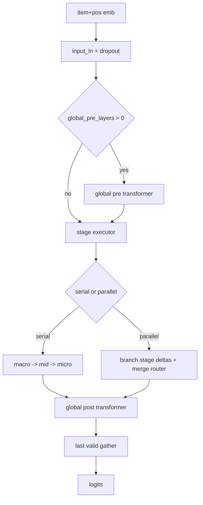
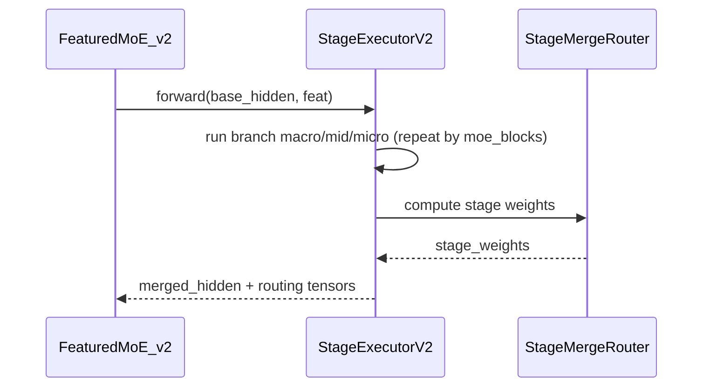

# FeaturedMoE_v2 Deep Dive

## 1) 모듈 구조
- 엔트리: `featured_moe_v2.py`
- 설정 검증: `config_schema.py`
- layout 파서: `layout_schema.py`
- stage 블록: `stage_modules.py`
- 실행 오케스트레이션: `stage_executor.py`
- 병렬 merge 라우터: `merge_router.py`
- 스케줄: `schedule.py`
- 보조 손실: `losses.py`

## 2) Layout 스키마와 경계 의미
stage별로 다음 두 값을 반드시 가진다.
- `pass_layers`: MoE 적용 전 attention-only 레이어 수
- `moe_blocks`: `[1-layer attention + 1 MoE]` 반복 횟수

즉,
- 어디까지 MoE 없이 통과하는지,
- 어디서 MoE가 시작되는지,
- stage별 반복 강도가 얼마인지
를 layout 하나로 표현한다.

## 3) 실행 순서

## 4) Serial / Parallel / Parallel+Repeat
### Serial
- stage를 순차 적용
- 이전 stage 출력이 다음 stage 입력이 됨

### Parallel
- 동일 `base_hidden`에서 stage branch 독립 계산
- branch 출력은 `delta = branch_out - base_hidden`로 변환
- merge router가 stage weight를 계산해 가중합

### Parallel+Repeat
- 각 stage branch 내부에서 `moe_blocks` 횟수만큼 반복
- 반복마다 `1-layer attention -> stage MoE` 순서 적용

## 5) 스케줄 동작
epoch마다 아래 상태를 계산해 stage 모듈에 전달한다.
- `alpha_scale`
- `mid_router_temperature`
- `micro_router_temperature`
- `stage_top_k`

## 6) 실패 패턴
- OOM: `moe_blocks`/`expert_scale`/batch가 동시에 큰 경우
- parallel stage collapse: `stage_gate_top_k`가 너무 작은 경우
- 불안정한 수렴: temperature/top-k warmup이 급격한 경우

## 7) 체크리스트
1. 시작 로그에서 layout summary와 execution mode 확인
2. `serial|parallel`이 의도한 값인지 확인
3. parallel일 때 stage gate 분포 쏠림 여부 확인
4. 산출물이 `fmoe_v2` 경로에 기록되는지 확인
