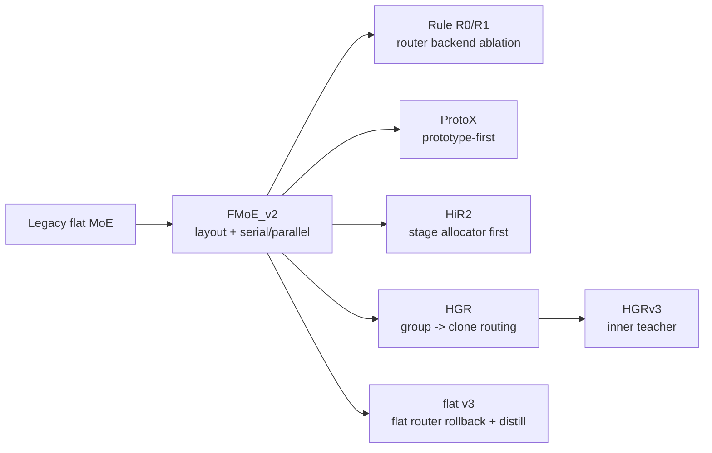
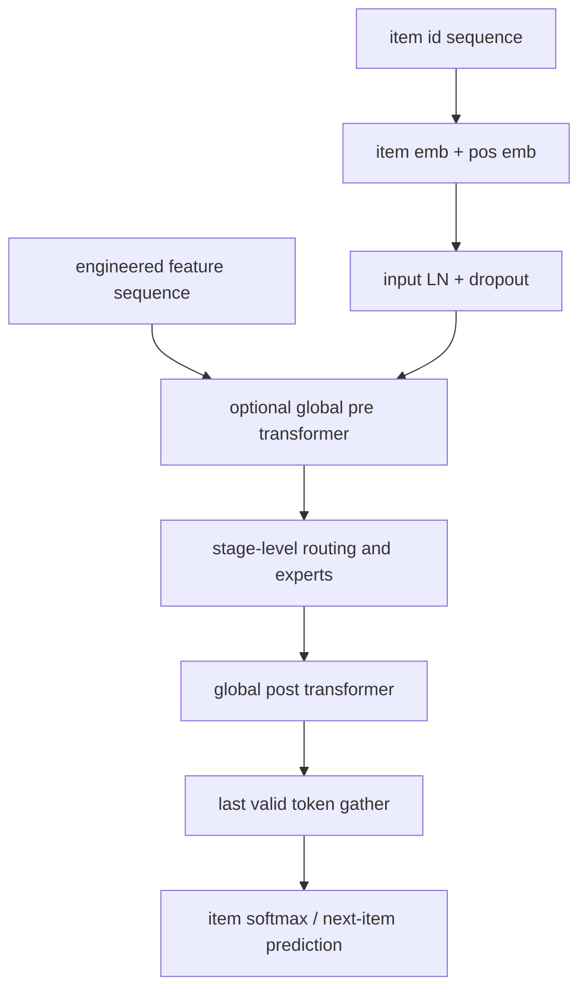
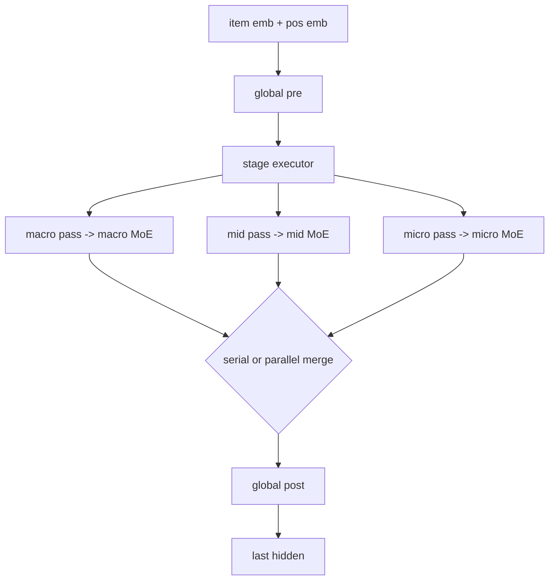
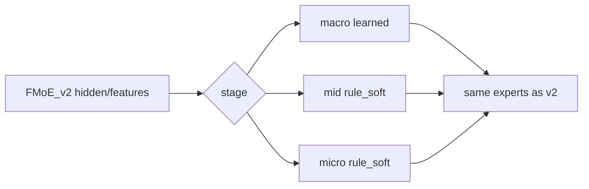
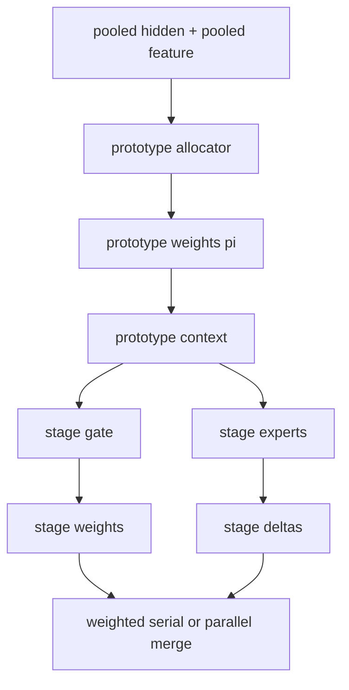
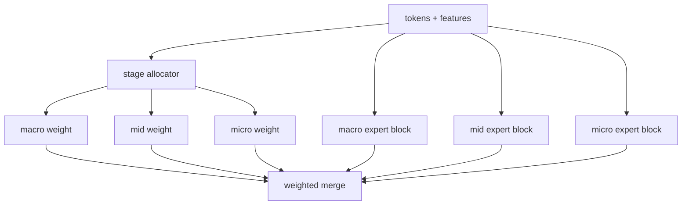
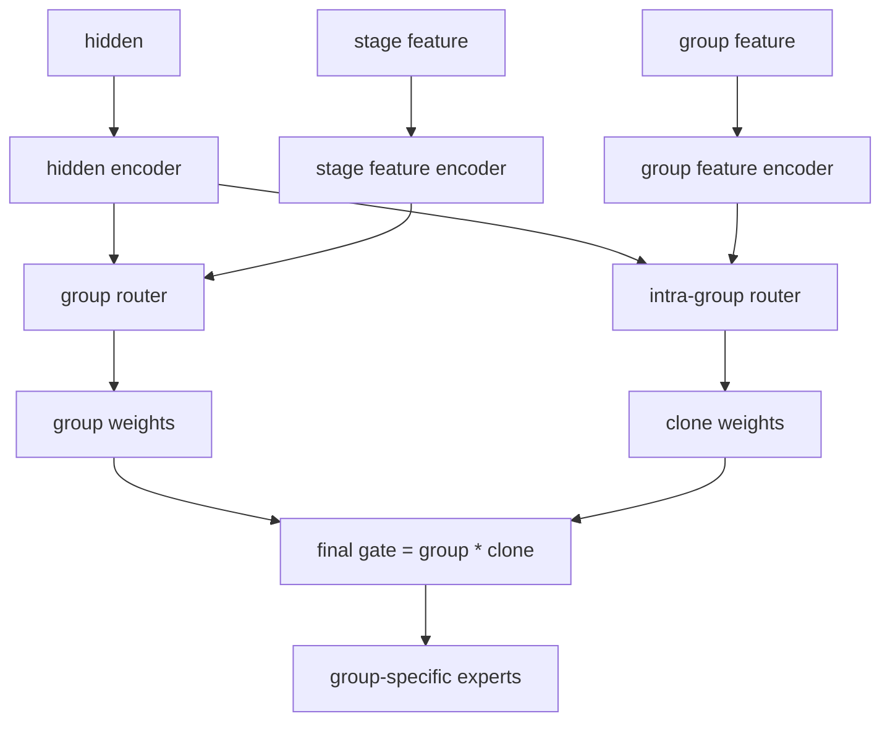
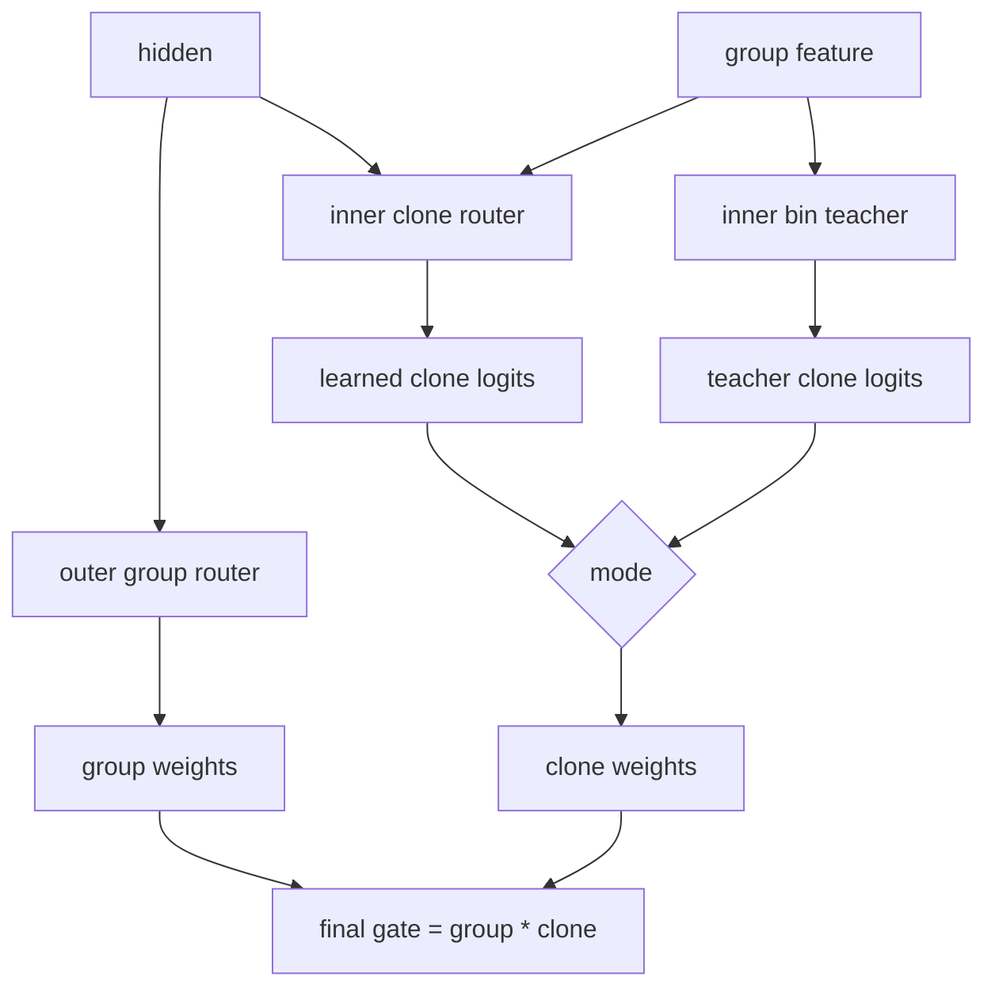
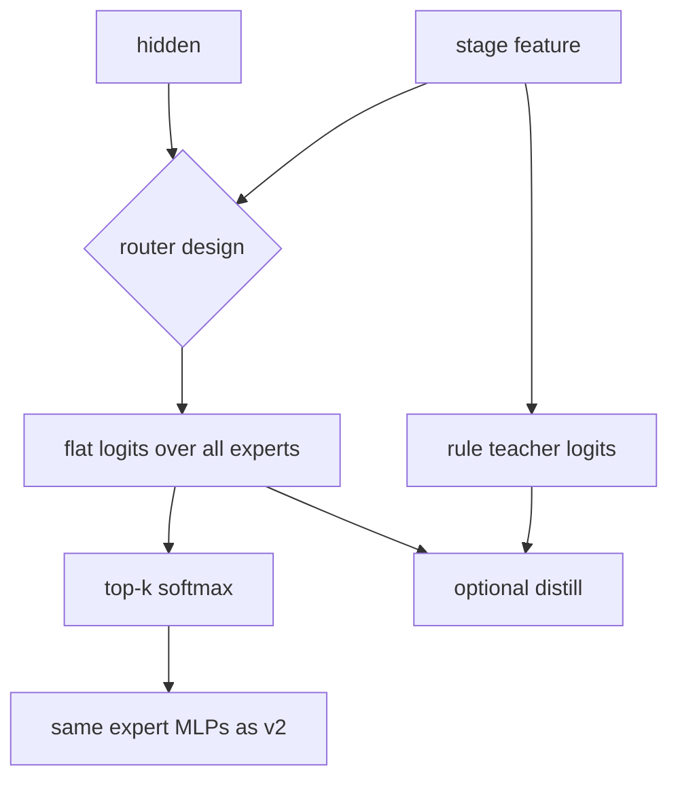

# FMoE 모델 구조 변천사 상세

- 작성 기준 시각: 2026-03-10 03:05 UTC
- 목적: 발표용 메인 보고서의 `모델 구조 변천사` 파트를 더 자세히 설명하는 보강 문서
- 범위: `FMoE_v2`, `Rule`, `ProtoX`, `HiR2`, `HGR`, `HGRv3`, `flat v3`
- 읽는 법: 각 모델은 `
` 토글로 접고 펼칠 수 있다. 슬라이드로 옮길 때는 각 토글을 1장 기준으로 쓰면 된다.

## 전체 요약

- 현재 구조의 기준선은 `FMoE_v2`다. `layout + serial/parallel + router backend 교체`를 한 엔진에서 다룰 수 있게 만든 것이 핵심이다.
- `Rule`은 새 모델이라기보다 `FMoE_v2`의 router backend ablation이다. expert는 그대로 두고 router만 `learned`와 `rule_soft`로 바꿔 본 실험이다.
- `ProtoX`와 `HiR2`는 stage 바깥에 상위 decision layer를 한 번 더 둔 구조다. 각각 `prototype`과 `stage allocator`를 먼저 추정한다.
- `HGR`은 router를 `group -> clone` 2단으로 분리해 outer/inner routing을 명시적으로 해석하려는 구조다.
- `HGRv3`는 HGR에서 teacher 위치를 outer group이 아니라 inner clone 쪽으로 옮긴 버전이다.
- `flat v3`는 최신 구조를 더 복잡하게 만드는 대신, flat router 자체를 다시 뜯어보는 rollback + distill 실험 트랙이다.

## 큰 흐름

## 공통 scaffold

대부분의 모델은 아래 공통 뼈대를 공유한다.

차이는 거의 전부 `E`에서 난다. 즉, 어느 정보를 router에 넣는지, expert를 몇 단계로 고르는지, aux/distillation을 어디에 거는지가 모델 차이의 본질이다.

## 빠른 비교표

| 모델 | router 입력 | expert 선택 방식 | expert 동작 | aux / distill 위치 | 발표용 한 줄 |
|---|---|---|---|---|---|
| `FMoE_v2` | hidden, stage feature, 일부 stage는 session pooling | flat `K`-way 또는 `group -> clone` | hidden + expert feature subset MLP, residual delta | expert balance, stage-merge aux, feature-spec, group distill | 가장 실전적인 mainline |
| `Rule` | stage feature ratio only | `rule_soft`로 expert score 직접 계산 | `FMoE_v2`와 동일 | `FMoE_v2`와 동일 | router만 rule로 바꾼 ablation |
| `ProtoX` | pooled hidden/feature -> prototype -> stage gate | `prototype -> stage -> expert` | prototype context를 hidden/feature에 주입한 stage expert | prototype usage/entropy, stage alloc aux | prototype-first 가설 검증 |
| `HiR2` | pooled hidden/feature -> stage allocator | `stage -> expert` | stage별 token MoE delta를 allocation weight로 합침 | stage alloc balance, stage entropy | 가장 해석하기 쉬운 2단 게이팅 |
| `HGR` | hidden + stage/group feature interaction | `group -> clone` | group 내부 clone mixture 후 outer group mixture | group/intra balance, group feature-spec, outer distill | router를 가장 구조적으로 분해한 브랜치 |
| `HGRv3` | outer hidden-only, inner hidden + group feature | `group -> clone` | HGR와 유사하되 inner clone teacher 사용 | inner rule distill 또는 fused bias | teacher 위치를 inner로 옮긴 실험 |
| `flat v3` | hidden only / hidden+stage / group bias / clone residual | flat `K`-way | 기본 expert는 v2와 동일 | group/clone distill mode 비교 | flat router semantics 재검증 |

<strong>1. FMoE_v2</strong> - 현재 mainline

### 왜 만들었나

기존 `FeaturedMoE`를 바로 뜯는 대신, `layout`, `serial/parallel`, `router_impl`, `aux` 축을 독립적으로 실험할 수 있는 새 엔진이 필요했다. 그래서 `FMoE_v2`는 모델 자체보다도 "실험 운영용 구조 프레임"에 더 가깝다.

### 구조 한 장 요약

| 항목 | 내용 |
|---|---|
| stage 구조 | `pass_layers` + `moe_blocks`를 가진 layout object |
| 실행 모드 | `serial`, `parallel` |
| router backend | `learned`, `rule_soft`, stage별 혼합 `router_impl_by_stage` |
| router granularity | flat `K`-way 또는 factorized `group -> clone` |
| expert | hidden-aware MLP, expert별 feature subset 사용 가능 |

### router에는 무엇이 들어가나

- 공통 입력은 `hidden`과 engineered `stage feature`다.
- `macro`는 `token` 또는 `session` routing을 쓸 수 있고, `session_pooling=query|mean|last`를 지원한다.
- `mid`, `micro`는 기본적으로 token-level routing이며, `mid_valid_r`, `mic_valid_r` 같은 reliability feature로 feature 경로를 약하게 누를 수 있다.
- 실행 중 `temperature`와 `top_k`는 schedule로 바뀔 수 있다.

### expert는 어떻게 선택하나

- `flat_legacy`
  - `hidden`과 projected `stage feature`를 concat해서 `K`-way router MLP에 넣는다.
  - 결과는 expert 수만큼의 logits이고, `top_k`가 있으면 top-k softmax, 없으면 dense softmax다.
- `group_factorized_interaction`
  - hidden과 stage feature를 각각 encoder로 보낸 뒤 `concat`, `elementwise product`, `absolute difference`를 묶어 interaction representation을 만든다.
  - 먼저 `group_router_head`가 outer group logits를 만들고, 그 다음 각 group마다 `intra_group_router_head`가 clone logits를 만든다.
  - 최종 gate는 `group_weight * clone_weight`, 최종 logits는 `group_logits + intra_group_logits`다.
- `rule_soft`
  - learned MLP를 안 쓰고, stage feature 일부를 ratio-bin으로 바꿔 expert score를 직접 만든다.
  - `n_bins`, `feature_per_expert`, `expert_bias`가 핵심 knob다.

### expert는 어떻게 동작하나

- 각 expert는 `hidden`, 혹은 자신의 feature subset, 혹은 둘 다를 입력으로 받는 MLP다.
- feature를 쓰는 경우 expert마다 다른 feature subset을 `feature_proj -> MLP`로 보낸다.
- `expert_scale`이 2나 3이면 base expert를 clone해서 같은 feature를 보되 파라미터는 따로 가진다.
- expert 출력의 가중합이 `stage_delta`가 되고, 최종 hidden은 residual 형태로 `hidden + alpha * stage_delta`가 된다.

### aux / distillation은 어디에 들어가나

- `expert balance aux`: expert collapse 방지
- `stage merge aux`: `parallel`일 때 stage merge router가 한 stage에만 몰리지 않게 regularize
- `feature specialization aux`: 선택한 stage에서 특정 feature가 특정 expert로 과도하게/무의미하게 흩어지지 않도록 보조
- `router distill aux`: factorized router에서 outer group logits를 rule teacher group logits에 KL로 맞춤

### 왜 이 구조가 mainline이 됐나

- 구조를 많이 바꿔도 공통 scaffold를 유지하므로 비교가 쉽다.
- `serial`과 `parallel`을 같은 엔진에서 비교할 수 있어 ML1M anchor를 빨리 잡을 수 있었다.
- 나중에 `rule`, `factorized`, `distill`, `RR transfer`를 모두 이 위에 얹을 수 있어서 실험 운영성이 가장 좋았다.

### 발표용 한 줄

`FMoE_v2`는 "실험 프레임이 된 모델"이다. 이후 브랜치 대부분이 이 엔진 위에서 router만 바꾸거나 상위 decision layer를 하나 더 얹는 방식으로 파생됐다.

<strong>2. Rule (R0 / R1)</strong> - 새 모델이 아니라 `FMoE_v2`의 router ablation

### 핵심 포인트

`Rule`은 expert를 바꾸는 실험이 아니다. hidden 흐름과 expert MLP는 그대로 두고, router만 `learned`에서 `rule_soft`로 바꾼 실험이다.

### `R0`와 `R1`의 차이

| 설정 | router |
|---|---|
| `R0` | 전 stage `rule_soft` |
| `R1` | `macro`는 learned, `mid/micro`는 `rule_soft` |

### router에는 무엇이 들어가나

- `rule_soft`는 hidden을 거의 쓰지 않는다.
- stage feature 일부를 뽑아 ratio space로 정규화하고, 이를 bin으로 나눠 expert score를 만든다.
- 즉, learned router처럼 "hidden과 feature의 상호작용"을 배우는 대신, feature ratio의 규칙성을 바로 gate에 투영한다.

### expert는 어떻게 동작하나

- 완전히 `FMoE_v2`와 동일하다.
- 그래서 `Rule` 실험은 "성능 차이가 router에서 나는지"를 비교하기 좋은 ablation이다.

### aux / distillation

- `FMoE_v2`의 aux 체계를 그대로 쓴다.
- 다만 rule-only stage는 learned logits가 없으므로 learned router distillation보다는 rule 자체가 직접 gate를 정의하는 해석에 가깝다.

### 실험 해석

- `R0`는 너무 경직적이었다. macro까지 rule로 고정하면 sequence hidden이 주는 문맥 적응력을 잃는다.
- `R1`은 `macro`만 learned로 남겨 문맥 적응력을 살리고, `mid/micro`만 rule로 고정해서 noise를 줄이려는 의도였다.
- ML1M에서 `R1`이 약하게 이득을 본 이유도 이 "상단은 learned, 하단은 rule" 분업 덕분으로 해석하는 편이 맞다.

### 발표용 한 줄

`Rule`은 별도 구조라기보다 "router만 바꿔서 무엇이 먹히는지 본 실험"이고, 결국 pure rule보다 hybrid rule만 의미가 있었다.

<strong>3. ProtoX</strong> - prototype-first routing

### 왜 만들었나

session이 먼저 어떤 prototype mixture에 속하는지 알 수 있다면, 그 다음 stage allocation과 expert routing이 더 안정적으로 될 수 있다는 가설이다. 즉, routing 앞에 `prototype latent`를 하나 더 넣은 구조다.

### 구조 한 장 요약

| 항목 | 내용 |
|---|---|
| 1단 | `SessionPrototypeAllocator`가 `pi over K prototypes` 추정 |
| 2단 | `PrototypeConditionedStageGate`가 `macro/mid/micro` 비중 계산 |
| 3단 | prototype-conditioned stage expert가 token-level expert routing 수행 |

### router에는 무엇이 들어가나

- prototype allocator는 pooled hidden과 pooled feature를 받아 prototype logits를 만든다.
- `top_k`가 켜져 있으면 prototype mixture도 sparse하게 만들 수 있다.
- prototype weight와 prototype bank를 곱해 `proto_context`를 만든 뒤, 이 context를 stage gate와 stage expert 양쪽에 같이 넣는다.
- stage gate는 `proto_context + pooled hidden/feature`를 보고 `macro/mid/micro` 3-way softmax를 만든다.
- 옵션으로 `token_correction`이 있어, token-level stage logits를 평균 내어 session-level stage gate에 보정항으로 더한다.

### expert는 어떻게 동작하나

- stage expert block 내부는 기본적으로 `MoEStage`다.
- 차이는 router와 expert 입력을 그대로 쓰는 대신, `proto_context`를 hidden과 feature에 projection해서 더해 준다는 점이다.
- 즉, 같은 token이라도 어떤 prototype mixture에 속했는지에 따라 다른 expert를 고르게 만든다.

### aux / distillation

- `expert balance aux`
- `stage allocation balance aux`
- `prototype usage KL`: 일부 prototype만 쓰는 collapse 방지
- `prototype entropy KL`: prototype mixture가 너무 날카롭거나 무의미하게 퍼지는 것 방지

### 실험 해석

- 장점은 해석이 쉽다는 점이다. "이 session은 어떤 prototype 조합인가"라는 설명 변수를 하나 더 얻게 된다.
- 단점은 optimization이 어렵다는 점이다. prototype allocator, stage gate, stage expert가 동시에 얽혀 초기 학습이 흔들리기 쉽다.
- 지금 수치가 낮은 이유도 구조 아이디어보다 optimization burden이 더 컸기 때문으로 보는 편이 맞다.

### 발표용 한 줄

`ProtoX`는 routing 앞단에 prototype latent를 넣어 설명력을 올리려는 시도였지만, 지금은 설명력보다 학습 난도가 더 크게 작용했다.

<strong>4. HiR2</strong> - stage allocator를 먼저 두는 2단 게이팅

### 왜 만들었나

stage allocation을 먼저 결정하고, 그 안에서 token-level expert routing을 하면 구조가 더 해석 가능해질 것이라는 가설이다. `ProtoX`와 다르게 prototype latent는 없고, 바로 `stage allocator`로 들어간다.

### 구조 한 장 요약

| 항목 | 내용 |
|---|---|
| 1단 | pooled hidden/feature -> `StageAllocator` |
| 2단 | 각 stage에서 `StageExpertBlock`으로 token-level routing |
| merge | `serial_weighted`, `parallel_weighted` |

### router에는 무엇이 들어가나

- stage allocator는 `query|last|mean` pooling을 지원한다.
- pooled hidden과 pooled feature를 합쳐 `macro/mid/micro` 3-way logits를 만든다.
- `top_k`가 켜지면 stage allocation 자체도 sparse해질 수 있다.
- stage 내부의 expert router는 다시 token-level `MoEStage`를 사용한다. 즉, outer는 session-level, inner는 token-level이다.

### expert는 어떻게 동작하나

- 각 stage expert block은 `MoEStage` wrapper다.
- block이 내는 것은 `next_hidden` 자체가 아니라 `stage_delta`다.
- `serial_weighted`에서는 이전 stage 결과를 다음 stage 입력으로 넘기고, `parallel_weighted`에서는 공통 base hidden에서 각 stage delta를 따로 만든 뒤 weighted sum 한다.

### aux / distillation

- stage 내부 expert balance aux
- stage allocator balance aux
- stage allocation entropy aux
- optional FFN-MoE aux

### 실험 해석

- 구조 설명은 아주 깔끔하다. "먼저 어느 stage를 볼지 정하고, 그 안에서 expert를 고른다"는 서사가 직관적이다.
- 하지만 실제 성능은 좋지 않았다. outer allocator가 잘못되면 그 뒤 inner router가 아무리 좋아도 회복이 어렵다.
- 즉, 해석성은 올랐지만 error correction 경로가 줄어든 구조라고 볼 수 있다.

### 발표용 한 줄

`HiR2`는 가장 설명하기 쉬운 2단 게이팅이지만, 현재 결과는 “해석성 상승 = 성능 상승”으로 연결되지 않았다.

<strong>5. HGR</strong> - group router와 clone router를 분리한 계층형 router

### 왜 만들었나

flat router는 expert를 한 번에 고르기 때문에 "어느 group을 고른 건지"와 "그 group 안에서 왜 이 clone이 뽑혔는지"가 분리되지 않는다. HGR은 이 두 단계를 명시적으로 쪼개서 router를 구조적으로 해석하려는 시도다.

### 구조 한 장 요약

| 항목 | 내용 |
|---|---|
| outer routing | group logits (`macro/mid/micro` stage 내부 4개 group) |
| inner routing | 각 group 내부 clone logits |
| final gate | `group_weight * intra_group_weight` |
| group router mode | `stage_wide`, `per_group`, `hybrid` |

### router에는 무엇이 들어가나

- hidden, stage feature, group feature를 따로 encode한다.
- `group_router_mode`
  - `stage_wide`: stage-level representation 하나로 4개 group을 한 번에 분류
  - `per_group`: group마다 scalar scorer를 따로 계산
  - `hybrid`: 둘을 더해서 outer group logits 생성
- inner router는 group별 feature와 hidden의 interaction을 받아, 그 group 내부 clone들 중 무엇을 쓸지 정한다.
- 최종 gate는 outer group softmax와 inner clone softmax를 곱해서 만든다.

### expert는 어떻게 동작하나

- expert는 group 단위로 묶여 있다.
- 먼저 각 group 내부 clone expert 출력을 `intra_group_weight`로 섞고, 그 다음 group output들을 `group_weight`로 한 번 더 섞는다.
- 그래서 flat router보다 "큰 의미 그룹"과 "세부 clone"이 분리된다.

### aux / distillation

- `expert balance aux`
- `group balance aux`
- `intra-group balance aux`
- `group feature specialization aux`
- `router distill aux`
  - factorized router의 outer group logits를 rule teacher group logits에 KL로 맞춘다.
  - teacher는 stage feature 비율 기반의 `RuleSoftRouter`다.

### 왜 HGR이 구조 실험으로 좋았나

- 어떤 레벨에서 성능이 오르거나 깨지는지 해석이 쉽다.
- `stage_wide`가 좋은지, `per_group`이 좋은지, outer distill이 도움이 되는지 같은 질문을 분리해서 답할 수 있다.
- absolute best는 mainline을 못 넘었지만, "어디에 supervision을 걸어야 하는가"에 대한 힌트를 가장 많이 줬다.

### 발표용 한 줄

`HGR`은 성능 최종 승자는 아니지만, router를 가장 잘 분해해서 보여준 브랜치였다.

<strong>6. HGRv3</strong> - outer는 단순화하고 teacher는 inner clone으로 이동

### 왜 만들었나

HGR의 outer distill은 "group을 어떻게 고를 것인가"에는 힌트를 주지만, 실제 fine-grained 선택은 clone 레벨에서 일어난다. 그래서 HGRv3는 outer를 hidden-only로 단순화하고, teacher를 inner clone 쪽으로 옮긴 구조다.

### 구조 한 장 요약

| 항목 | 내용 |
|---|---|
| outer router | 기본은 hidden-only group router |
| inner router | hidden + group feature interaction |
| teacher | group-local feature ratio로 clone teacher logits 생성 |
| mode | `off`, `distill`, `fused_bias`, `distill_and_fused_bias` |

### router에는 무엇이 들어가나

- outer router
  - 현재 quick probe 기본값은 `outer_router_use_hidden=true`, `outer_router_use_feature=false`
  - 즉, outer group 선택은 token/session hidden만 본다.
- inner router
  - group별 feature를 따로 encode하고, hidden과 `concat / product / abs diff` interaction을 만든다.
  - 이 representation으로 group 내부 clone logits를 계산한다.
- teacher
  - 각 group feature를 ratio space로 바꿔 평균 score를 만든 뒤, clone 중심점과 거리 기반으로 teacher logits를 만든다.

### expert는 어떻게 동작하나

- expert path 자체는 HGR와 거의 같다.
- 차이는 gate를 만드는 경로다. outer는 더 단순해지고, inner는 learned clone logits에 teacher를 붙인다.

### aux / distillation

- `expert balance aux`
- `group balance aux`
- `intra-group balance aux`
- `group feature specialization aux`
- `inner rule distill aux`
  - student: `intra_group_logits_raw`
  - teacher: `teacher_intra_group_logits`
  - mode별 차이
    - `off`: teacher 안 씀
    - `distill`: inference는 learned logits, 학습 때만 KL
    - `fused_bias`: inference logits에 `bias_scale * teacher` 추가
    - `distill_and_fused_bias`: 둘 다

### 지금 돌고 있는 실험을 어떻게 해석하면 되나

- `distill > off`
  - inner clone supervision이 실제로 도움이 된다는 뜻이다. R1에서 distill 강도와 stage별 적용 범위를 늘릴 이유가 생긴다.
- `fused_bias > distill`
  - teacher를 loss로만 쓰는 것보다 inference-time bias로 직접 섞는 게 낫다는 뜻이다.
- 둘 다 약함
  - inner teacher 위치는 맞더라도 outer hidden-only 단순화가 과했을 수 있다. 그 경우 outer feature 복귀나 HGR outer distill 재사용을 본다.

### 발표용 한 줄

`HGRv3`는 “teacher를 outer가 아니라 inner clone에 걸어야 하지 않나?”라는 질문에 답하려는 현재 진행형 실험이다.

<strong>7. flat v3</strong> - flat router 자체를 다시 보는 rollback + distill 트랙

### 왜 만들었나

최신 구조를 계속 복잡하게 만드는 대신, flat router 자체가 어디서 약했고 어디서 강했는지 다시 확인할 필요가 있었다. 그래서 `flat v3`는 `pre-fmoe-v2-router-overhaul-20260309` 시점의 flat-router 계열을 복원해 baseline으로 다시 보는 트랙이다.

### 구조 한 장 요약

| 항목 | 내용 |
|---|---|
| 기본 scaffold | `FMoE_v2`와 유사한 layout / serial / parallel |
| 핵심 변화 | flat router design 비교 |
| 실험 축 | router structure, distill mode, routing semantics, dim robustness, RR transfer |

### router design은 무엇을 비교하나

- `flat_legacy`
  - `hidden + projected stage feature` concat -> flat expert logits
- `flat_hidden_only`
  - hidden만으로 flat expert logits
- `flat_global_interaction`
  - hidden encoder와 stage feature encoder의 interaction으로 flat expert logits
- `flat_group_bias12`
  - global interaction logits에 group bias를 clone 전체에 반복해서 더함
- `flat_clone_residual12`
  - global interaction logits에 group별 clone residual을 더함
- `flat_group_clone_combo`
  - group bias와 clone residual을 둘 다 더함

### expert는 어떻게 동작하나

- expert 자체는 `FMoE_v2`와 거의 같다.
- 즉, 이 트랙은 "expert를 바꾸는 실험"이 아니라 "flat router semantics를 다시 고르는 실험"이다.

### distillation은 어떻게 넣나

- teacher는 stage feature 비율에서 만든 rule-style teacher logits이다.
- student flat gate logits를 `group logits + clone logits`으로 분해해 teacher와 맞춘다.
- mode
  - `none`
  - `group_only`
  - `clone_only`
  - `group_plus_clone`
- 보통 `group_only`는 coarse semantics, `clone_only`는 fine semantics, `group_plus_clone`은 둘 다 맞추는 시도라고 보면 된다.

### 지금 진행 중인 실험을 어떻게 읽으면 되나

- `flat_hidden_only`가 강하다
  - stage feature 경로가 noisy했을 수 있다.
- `flat_group_bias12`가 강하다
  - coarse group semantics는 유효하지만 clone fine-tuning은 과했을 수 있다.
- `flat_clone_residual12`가 강하다
  - 같은 group 안에서 clone-level 미세 분기가 실제로 도움이 된다는 뜻이다.
- `group_plus_clone`이 강하다
  - teacher supervision을 한 레벨만이 아니라 두 레벨에 같이 거는 방향이 유효하다는 뜻이다.

### 발표용 한 줄

`flat v3`는 새 구조를 또 얹는 대신, flat router가 정확히 어디서 약한지 다시 분해해 보는 rollback control이다.

## 발표용 정리 문장

- `FMoE_v2`: 운영성과 성능을 동시에 만족한 mainline
- `Rule`: expert는 그대로, router만 바꿔 본 가장 깨끗한 ablation
- `ProtoX`: prototype latent를 먼저 추정한 prototype-first 가설
- `HiR2`: stage allocator를 먼저 두는 가장 직관적인 2단 게이팅
- `HGR`: router를 `group -> clone`으로 분해해 가장 잘 설명해 준 브랜치
- `HGRv3`: teacher 위치를 inner clone으로 옮긴 현재 진행형 실험
- `flat v3`: flat router semantics와 distillation 위치를 다시 점검하는 rollback control

## 근거 파일

- `FMoE_v2`: `experiments/models/FeaturedMoE_v2/{quick_guide.md,deep_dive.md,stage_modules.py,featured_moe_v2.py}`
- `Rule`: `experiments/run/fmoe_rule`, `experiments/models/FeaturedMoE/routers.py`
- `ProtoX`: `experiments/models/FeaturedMoE_ProtoX/{quick_guide.md,featured_moe_protox.py,protox_modules.py}`
- `HiR2`: `experiments/models/FeaturedMoE_HiR2/{quick_guide.md,featured_moe_hir2.py,hir2_modules.py}`
- `HGR`: `experiments/models/FeaturedMoE_HGR/{featured_moe_hgr.py,hgr_moe_stages.py,losses.py,experiment_summary.md}`
- `HGRv3`: `experiments/models/FeaturedMoE_HGRv3/{featured_moe_hgr_v3.py,hgr_v3_moe_stages.py,losses.py}` + `experiments/run/fmoe_hgr_v3/HGRV3_STRUCTURE.md`
- `flat v3`: `experiments/models/FeaturedMoE_v3/{featured_moe_v2.py,legacy_moe_stages.py,losses.py}` + `experiments/run/fmoe_v3/{README.md,ROUTER_PLAN_v3.md}`
